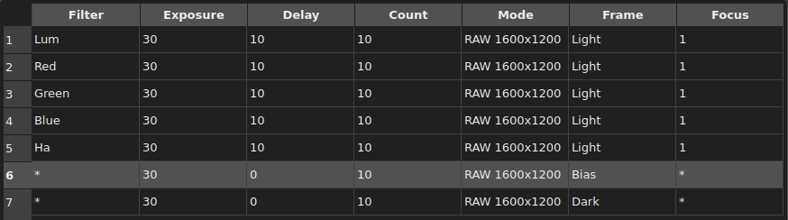

# Ain INDIGO Imager - Users Guide
Revision: 20.05.2023 (draft)

Author: **Rumen G.Bogdanovski**

e-mail: *rumenastro@gmail.com*

*Special thanks to Bill Tschumy for reviewing the document*

## Table of Contents
1. [Introduction](#introduction)
1. [Main Window](#main-window)
1. [General Concepts](#general-concepts)
1. [Connecting to INDIGO services](#connecting-to-indigo-services)
1. [Image capture](#image-capture)
1. [Sequences](#sequences)
1. [Focusing](#focusing)
1. [Guiding](#guiding)
1. [Telescope control](#telescope-control)
1. [Plate solving](#plate-solving)
1. [Accessing advanced device and agent settings](#accessing-advanced-device-and-agent-settings)
1. [Managing service configurations](#managing-service-configurations)

## Introduction
*Ain INDIGO Imager* is a free and open source astronomical image acquisition application distributed under [INDIGO Astronomy open-source license](https://github.com/indigo-astronomy/indigo_imager/blob/master/LICENSE.md). *Ain* is designed to be easy to use and lightweight. It requires a running [INDIGO Server](https://github.com/indigo-astronomy/indigo/blob/master/indigo_docs/INDIGO_SERVER_AND_DRIVERS_GUIDE.md).

*Ain* is supported on Linux and Windows operating systems and is available for download on the [INDIGO Astronomy](https://www.indigo-astronomy.org/downloads.html) website.

*Ain* is designed to be simple with very little business logic embedded, all the hard work is done by the INDIGO agents. It is essentially a user interface for the INDIGO agents. Because of that, upon connecting, *Ain* will automatically load any agents it needs to operate.

## Main Window

The main window is divided in three main areas as seen in the picture below:

Almost all widgets (buttons, drop-down menus, spin boxes etc.) have tool-tips with information on what the widget does. In the case of numeric values they  also indicate the range of valid input.

### Control area
This is the upper left area consisting of several tabs and sub-tabs. The control area is where all configuration is done and all processes are controlled, such as guiding, taking exposures etc. It will be described in detail in the following chapters.

### Image area
This is the upper right area of the main window. In this area the most recently captured image will be displayed. It is context dependent as follows:

* In the **Capture**, **Focus** and **Telescope** tabs, the last image from the main imaging camera will be displayed. Several overlays can be turned on or off such as image statistics (controlled by **Settings -> Show image statistics**) and image center mark (**Settings -> Show image center**).

* In the **Guider** tab, the most recent image from the guiding camera is displayed and overlays for the selected guide stars and the image’s reference point are shown. This is described in detail in a later chapter.

* In the **Solver** tab, the image currently being solved is displayed.

When the mouse cursor is over the image, the current pixel value will be displayed in the upper right along with the mouse coordinates and the zoom level. Next to this are several buttons for controlling zooming and stretching.

If the **Solver** or **Telescope** tab is active and the current image has been solved, the Right Ascension and Declination of the point under the mouse cursor is shown instead of the pixel coordinates. In this case **Right-Clicking** on the image will copy the coordinates under the mouse into the **Telescope** tab. Pushing the **Goto** button will then slew the telescope to center on these coordinates (use **Control + Right-Click** to copy the coordinates and slew the telescope as a single action).

The mouse wheel zooms in or zoom out of the image and **Left-Click + Drag** will pan the image.

### Log area
Log area is the bottom part of the main window. In this area all messages from the INDIGO framework will be displayed, preceded by a timestamp. There are three types of messages: *Information* - displayed in white, *Error* - displayed in red and *Warning* - displayed in yellow. *Ain* does not display errors or warnings in dialog boxes, all errors, warnings and messages are displayed in this log. In addition each message can be accompanied by an audible notification. Audible notifications are enabled by **Settings -> Play sound notifications**.

## General Concepts

### Data storage
By default Ain will store the files in a subdirectory of your home directory called "ain_data". Frames obtained on different dates will be saved in different subdirectories with format "YYYY-MM-DD". The output directory changes automatically at noon, to keep the data from the same night in the same directory. The data directory can be changed from **File -> Select Data Directory**

### Widget color coding
*Ain Imager* uses colors to represent the states of the operations. Related widgets will be decorated differently depending on the status. **Default** color (or **green** in some cases) means that the operation is idle or finished successfully. **Red** means operation failed or is canceled by the user. **Yellow** means the operation is in progress.

For example:

* Aborted exposure, **Expose** button in **red**:

	

* Exposure in progress, **Expose** button in **yellow**:

	

* Exposure completed successfully, **Expose** button in default color:

	

## Connecting to INDIGO services
*Ain* will automatically discover all INDIGO services available on the network. And depending on **Settings -> Auto connect new services** it will connect or not to the newly discovered services.

Services can be managed from **File -> Available Services** as shown below.

All available services will be listed. Use the checkboxes to connect or disconnect from a service. The connection status of the services will be restored when *Ain* is restarted, provided the service is still available. In the example above, the service "indigosky" is connected and "vega" and "indigo_test" are not.

The auto discovered services will be listed with the "Bonjour" icon in front of their name ("indigosky" and "vega") and can not be removed from the list. They will disappear when the server shuts down and reappear when it is back online.

Services that are not discoverable (not announced on the network or that are on a different network, in a remote observatory for example) can be manually added by the user. The service should be specified in the form **name\@host.domain:port** or **name\@ip_address:port** in the text field below the service list. If **port** is not specified the default INDIGO port (7624) is assumed. Also **name** has only one purpose, to give some meaningful name to the service and has nothing to do with the remote service. It can be any text string. If not specified **host** will be used as a service name. Such services are displayed with a blue planet icon ("indigo_test") and can be removed manually.

## Image capture
As mentioned above *Ain Imager* uses agents to operate and the top drop-down menu is for agent selection. In **Capture** tab, all available *Imager Agents* from all connected services will be listed. Depending on **Settings -> Use host suffix** it will show or not show the service name as a suffix (takes effect after reconnect). *Ain* can use only one imager agent at a time. Multi-agent support will come in the future.

##### Camera
All cameras available to the selected *Imager Agent* will be listed in the drop-down. The selected camera will be used for image acquisition.

##### Wheel
All filter wheels available to the selected *Imager Agent* will be listed in the drop-down. The user should select the one attached to the selected camera.

##### Frame
All frame resolutions and pixel depths supported by the selected camera will be listed in the drop-down along with the frame types such as "Dark", "Light", "Flat", etc.

##### Exposure
Exposure time (in seconds) when the **Expose** or **Preview** button is pressed to start capture of one or more images.

##### Delay
The delay (in seconds) between the exposures taken in a batch.

##### No Frames (Number of Frames)
How how many frames should be taken in the batch exposure. Use -1 for an unlimited number of frames. In this case the batch exposure will finish when **Abort** button is pressed.

##### Filter
All available filters in the selected filter wheel will be listed in the drop-down. The selected filter is the one currently being used.

##### Object
The name of the object being photographed should be entered here. It is used as a prefix of the saved file name and as an object name in the FITS header. If there is no name specified and **Settings -> Save noname images** is checked, "noname" string will be used as file name prefix, otherwise the images will not be saved and a warning will be printed in the log.

##### Cooler
If the selected camera can report the sensor temperature, the current temperature will be shown. If the camera supports cooling, it can be enabled and disabled here along with setting the target temperature. If cooling, the cooler power will be displayed.

### Image tab

##### Preview exposure
The time (in seconds) used to get a preview frame with the **Preview** button.

##### Image format
The image file formats supported by the camera driver will be listed here. They can be different for different cameras. The selected format will be used as a storage format for the saved images. **Raw data** format is a special case. It is supposed to be used by INDIGO internally, this is why batches and sequences will not save images taken as **Raw data** (as of Ain Imager version 0.99).

##### Region of interest
The region of interest (ROI) can be configured by specifying **X** and **Y** of the top left corner and **Width** and **Height** of the sub-frame.

### Dithering tab
INDIGO can dither between the frames and it is configured in this tab.

##### Target
All available *Guider agents* will be listed here. The selected one will be used for guiding and dithering. To disable dithering select "None".

##### Aggressivity
This value, in pixels, specifies the maximum number of pixels the frame should be shifted during dithering. The actual shift is a random value and this specifies the upper limit.

##### Settle timeout
The settle timeout is in seconds. It specifies how much time to wait for the guiding to settle after dithering. If it has not settled before this timeout is up, a warning is issued and the imager agent will proceed with the next exposure.

##### Skip Frames
Specifies how many frames to skip between dithering (0 means to dither after each frame).

### Camera tab
In this tab, camera specific parameters can be set: gain, offset and binning.

### Remote images tab
INDIGO services can work in the so called "clientless" or "headless" mode. This means that the server can operate autonomously. To achieve that the client must connect, configure the service to perform some specific task, start it and disconnect. The server will store the data locally and when the client connects again it can download the acquired data. This mode is configured in this tab.

 

To enable the server to store the captured frames locally, check **Save image copies on the server**. If one does not want downloaded images deleted from the server after downloading, check **Keep downloaded images on server** otherwise images will be deleted once downloaded.

If the server is configured to keep the downloaded images they can still be removed when no longer needed. This is achieved by unchecking **Keep downloaded images on server** and press **Server cleanup**. This will remove any images that have already been downloaded.  Those not yet downloaded are kept. This is useful when the images should be downloaded to several locations and removed once downloaded everywhere.

## Sequences

Image capture in a sequence is a feature of the *Imager Agent* and it is executed on the selected imager agent. Currently, sequences work with a single target, and target can not be changed. The user can specify filter, exposure time, delay between exposures, type of exposure etc., in each batch. For example (the screenshot below) we have a sequence with batches that will take 10 x 30s Light exposures in each of the filters: Lum, Red, Green, Blue and Ha. Focusing will be performed for each filter with 1s exposure. At the end it will take 10 Dark and 10 Bias exposures. Exposures will be saved with file name prefix "Rozette". The whole sequence will be repeated 3 times and at the end camera cooling will be stopped and the telescope will be parked. The running batch is indicated by a small arrow next to the batch number in the table.

The sequence capturing will use the *Imager Agent* selected in **Capture** tab, which means that the camera and the filter wheel selected there along with their configurations will be used. For focusing the focuser and its configuration will be used from the **Focus** tab.

### Editing sequence
Each sequence consists of separate bates that will be executed in a sequence. Each batch is described by several proprieties like: Filter to be used, exposure time, frame type etc. Batches can be added (**[+]** button), removed (**[-]** button) and edited. The batch order in a sequence can also be changed. Batches can be saved and loaded from file (*.seq*) and downloaded from the *Imager Agent*.

#### Sequence naming, ending and repetitions
The sequence name should be specified in the text field as shown below, This will be used as a file name prefix and object name in the FITS header. If there is no name entered and **Settings -> Save noname images** is checked, "noname" string will be used as file name prefix, otherwise the images will not be saved and a warning will be issued in the log.

The user can specify how many times the batches in the sequence should be executed by setting **Repeat** value (default is 1).

By checking **Turn cooler off** the cooling of the used camera will be turned off at the end of the sequence.

By checking **Park mount** the used mount will be parked at the end of the sequence.

#### Add, remove, move up, move down and update batches
To add a new batch to the sequence the user should describe its properties as shown below:

the batch will be added by pushing the **[+]** button:

In order to remove, move up or down or update a batch the user must select the batch by clicking on it (double clicking will remove the selection):

Once the batch is selected its properties will be loaded in the **Batch description**. The selected batch can be removed by pushing **[-]** button or moved up or down the sequence with the up and down arrow buttons. To edit the selected batch, the user must change the properties as needed, in the **Batch description** and click update button (the most right button in the group).

#### Download sequence from the agent, load from file and save to file
The already loaded sequence can be downloaded from the selected *Imager agent* by clicking the download button (left button):

Sequence can be loaded from file by clicking the folder button (the middle one) and choosing the sequence file.

The current sequence can be saved to a file by pushing the disk button (the right one) and providing a file name. The "*.seq*" extension will be automatically added.

The sequence being edited or loaded will be uploaded to the *Imager Agent* only when the sequence is started. Before that all the changes will remain in the client only. Because of that, if the user changes the sequence while it is running the changes will not take effect.

**NOTE:** Loading sequence from file or downloading it from the agent will replace the current sequence and unsaved changes will be lost.

###  Start, pause, abort and sequence progress monitoring

The current sequence can be started with the **Run** button. This will also upload the current sequence to the *Imager Agent* as described above.

The running sequence can be paused with the **Pause** button and resumed later. Please note pausing will not abort the current exposure, the process will pause after the current exposure is complete.

**Abort** button will stop the current sequence immediately and the shutdown tasks will not be performed. Clicking **Run** after abort will start from the beginning.

Progress can be monitored using the three progress bars shown above. The first one shows the elapsed time of the individual exposure. The second one shows the completed exposures in the current batch. And the third one shows the completed batches in the current sequence.

**Sequence duration** shows approximately how long the current sequence will take to complete in HH:MM:SS. Please note that this value is approximate as some operations like image download, filter change and focusing are unpredictable.

## Focusing
Focusing is a feature of the *Imager Agent* and it works with the selected imager agent.

##### Focuser
All focuser devices available to the selected *Imager Agent* will be listed here. The correct one should be selected.

##### Absolute position
The current focuser position will be displayed here. Entering a new value and pushing the **[>]** button will move the focuser to the new position. It can be used to assist the focusing by going roughly to focus or to retract the focuser at the end of the imaging session.

##### Relative Move
Relative move will help achieve precise focus manually. The value represents how many steps, relative to the current position, the focuser should move when **[>>]** (focus out) or **[<<]** (focus in) button is pushed.

##### Reference T (Templerature)
The current temperature will be shown if the focuser has a temperature sensor. If **Auto compensation** is checked, the focus will be automatically corrected with the temperature change if the compensation factor is set in the **Misc** tab. This value must be determined by the user since it is setup dependent.

### Statistics tab

Essential focusing statistics along with a graphical representation will be displayed during manual or automatic focusing. The information displayed depends on the on the focus estimator being used. For "Peak/HFD" estimator, half flux diameter (HFD) or full width half maximum (FWHM) will be displayed on the graph (configured with  **Settings -> Peak/HFD Focuser Graph**). For "RMS Contrast", the contrast will be shown.

### Settings tab

##### Exposure time
Exposure time in seconds used during the focusing process.

##### Focus mode
The focus mode "Manual" or "Auto".

##### Focus estimators
Currently the *Imager Agent* supports two focus estimators: "Peak/HFD" and "RMS Contrast".

##### Star selection X/Y
The coordinates of the star that will be used for "Peak/HFD" focusing should be entered here. **Right-Click** on the image will load the coordinates of the cursor here and will move the selection overlay (a green square).

##### Selection radius
The radius, in pixels, of the aperture used to estimate FWHM and HFD.

##### Autofocus settings
Auto focus configuration is described in [INDIGO Imager Agent - Autofocus Tuning Guide](https://github.com/indigo-astronomy/indigo/blob/master/indigo_docs/IMAGING_AF_TUNING.md)

### Misc (Miscellaneous) tab

##### Save bandwidth
In order to transfer less amount of data through the network sub-frames with size of 10 or 20 radii centered around the selection can be used. This is applicable only for "Peak/HFD" estimator.

##### Focus compensation
This is the temperature compensation factor, in steps per degree Celsius. It specifies how many steps will be applied when **Auto compensation** is ON with each degree change of the ambient temperature.

##### On focus failed (Peak/HFD)
This defines what to do if the auto focus procedure fails. If **Return to the initial position** is checked it will return to the starting position, otherwise it will just stop. This applies to "Peak/HFD" estimator only. With "RMS Contrast" it will always stop.

##### Invert In and Out motion
If the focuser is inverted and retracts on focus out motion the motion should be inverted. This drop-down menu will be active if the selected focuser supports motion inversion.

## Guiding
*Ain* uses the service *Guider Agent* for guiding. The top drop-down menu has a list of all available guider agents and the appropriate one should be selected.

##### Camera
All cameras available to the selected *Guider Agent* will be listed here. The appropriate one should be selected.

##### Guider
All guider devices available to the selected *Guider Agent* will be listed here. The appropriate one should be selected. They can be part of the mount or the ST4 port of the guiding camera.

##### Buttons
- **Preview** button will start a loop of exposures with the guider camera.
- **Calibrate** button will start the calibration process during which the guiding parameters will be determined automatically.
- **Guide** button starts the Guiding
- **Stop** button will stop each of the above processes.

### Settings tab

##### Exposure
Exposure time and delay between exposures can be specified in this section. Both are in seconds.

##### Guiding
*Guider Agent* provides several algorithms for drift detection and several options for Guiding in declination. Both can be selected here.

In "Selection" guiding the primary star can be selected by **Right-Clicking** on the star or by entering the coordinates in **Star Selection X/Y** fields. The radius of the circle where the star can drift between two consecutive frames is specified in **Selection radius** field. And for multi-star "Selection" guiding the number of stars to be used can be specified in the **Star count** field.

Only the first star can be selected manually or automatically. All other stars can only be auto selected. The list of the selected star can be cleared by pushing **Clear star selection** button. This will force the *Guider Agent* to make a new selection when any process is started.

In "Donuts" guiding the whole frame is used to detect drift but some cameras have unusable border around the frame. This can interfere with the guiding and this area can be excluded by specifying **Edge Clipping**

### Advanced tab

*Guder Agent* configuration is described in [INDIGO Guider Agent - PI Controller Tuning](https://github.com/indigo-astronomy/indigo/blob/master/indigo_docs/GUIDING_PI_CONTROLLER_TUNING.md) and in [Guider Agent README](https://github.com/indigo-astronomy/indigo/blob/master/indigo_drivers/agent_guider/README.md)

Calibration parameters will be automatically computed during the "calibration" process but they can be fine-tuned manually.

### Misc (Miscellaneous) tab

##### Save bandwidth
There are two options to reduce network traffic. As the guiding is done on the server *Ain Imager* does not need full resolution raw frames. It just needs basic images for visualization. This is why the user can choose to download JPEG images which can be more than 10x smaller and image sub-frames.

##### Camera Settings
Frame format, gain and offset of the guiding camera can be specified in this section.

##### Guider Scope Profile
The focal length of the guider scope should be entered in order to enable the drift to be displayed in arc seconds. Otherwise **Settings -> Guider Graph -> RA / Dec Drift (arcsec)** will have no effect and the statistics and graph views will be in pixels.

## Telescope control
*Ain* uses the service *Mount Agent* to control mounts. The top drop-down menu has a list of all available mount agents and the appropriate one should be selected.

If the displayed image is solved a **Right-Click** on it will copy the coordinates under the mouse cursor in the **RA / Dec input** boxes and pushing **Goto** button will slew the telescope to these coordinates. **Control + Right-Click** will copy and slew the telescope in one action.

##### Mount
All mounts available to the selected *Guider Agent* will be listed here. The appropriate one should be selected.

##### Az / Alt
Displays current target Azimuth and Altitude and uses color coding to give a visual clue of the target suitability to be observed:
* **Green** - target is high above the horizon and is good to observe.
* **Yellow** - target is low above the horizon.
* **Red** - target is below the horizon

##### RA / Dec input
In these fields the target Right ascension and Declination should be entered. They will be used for goto if **Goto** is button is pushed or to synchronize the mount to these coordinates if **Sync** is button is pushed.

### Main tab

##### N S W E buttons and slew rates
The mount can be moved by pushing **N S W E** buttons. The speed is selected from four available presets. The slowest is **Guide rate** and the fastest is **Max rate**.

##### Tracking / Not Tracking
This check box controls the mount tracking. The mount tracking is enabled if it is checked.

##### Go home
Checking this check box will slew the mount to its home position.

##### Parked / Unparked
Checking this checkbox will slew the mount to its park position.

### Object tab

Typing in the **Search** field will update the object list as you type with the objects that match the pattern. Once the desired object is selected its coordinates will be loaded in telescope coordinate fields and clicking on **Goto** will point the telescope to the selected object.

Each object in the list has a tool tip with information about the object like coordinates, magnitude and type.

#### Manage custom objects
Custom objects can be added by clicking on the **[+]** button in the object tab. The following dialog will appear:

The data fields should be filled and the **Add object** button should be pushed to create the custom object.  The current telescope coordinates can be loaded in the **Right ascension** and **Declination** fields by pushing the target button.

Pushing the **[-]** button will remove the selected custom object. Please note that standard library objects can not be removed.

### Solver tab

In the solver tab the user should select the image source and exposure time to be used. Two operations can be performed:
- **Solve & Center** - the selected agent will take an exposure, solve it, and using the solution as a reference will perform a precise goto to the target coordinates.
- **Solve & Sync** - the selected agent will take an exposure, solve it, and the solution will be sent to the telescope as a reference (sync the telescope with the solution). This will allow precise goto in the vicinity.

### Site (geographic location) tab

In the **Source** drop-down menu all available geo location sources will be listed. Examples include the GPS device selected in the **GPS** tab or the selected **Mount Agent** coordinates, which are set in the **Set Location / Time** section.

If **Keep the mount time synchronized** is checked, whenever the time or geo coordinates of the source are changed the mount will also be updated. This is somewhat dangerous as the GPS may lose its signal and the mount will lose alignment.

### GPS tab

In the **GPS** drop-down menu all available GPS devices will be listed. The selected GPS can be used as a time and geographic coordinates source in the **Site** tab. It also shows the position data from the selected device.

### Polar align tab

Performing the telescope polar alignment procedure is described in detail in [INDIGO Astrometry / ASTAP Agent - Polar Alignment Guide](https://github.com/indigo-astronomy/indigo/blob/master/indigo_docs/POLAR_ALIGNMENT.md).

## Plate solving
Plate solving configuration and usage is described in [INDIGO Astrometry Agent - Plate Solving Guide](https://github.com/indigo-astronomy/indigo/blob/master/indigo_docs/PLATE_SOLVING.md) and in [Astrometry Agent README](https://github.com/indigo-astronomy/indigo/blob/master/indigo_drivers/agent_astrometry/README.md)

If a local file needs to be solved, **Image source** should be set to "Upload file". In this case, pushing the **Solve** button will display a file select dialog for choosing the file to be solved.

## Accessing advanced device and agent settings

*Ain Imager* provides access to a subset of the standard properties of the devices and agents. The whole set of properties can be monitored and modified with the *INDIGO Control Panel*, free and open source application available for Linux and Windows.

 

 *Ain* provides a shortcut to it from **File -> INDIGO Control Panel**.

*INDIGO Control Panel* is essential for the initial service configuration like loading the necessary drivers and initial device configuration.

## Managing service configurations

Note: This feature is experimental!

*Ain Imager* can use *Configuration Agents* running on INDIGO services to manage the configuration of each service. It can save, load, delete and create new configurations for each INDIGO service. The configuration manager dialog can be accessed from **File -> Manage service configurations**.

Available configuration agents will be listed in the top drop-down menu and available configurations will be listed in the **Configuration** combo box.

More information about configuration management can be found in [INDIGO Configuration Agent README](https://github.com/indigo-astronomy/indigo/blob/master/indigo_drivers/agent_config/README.md).
