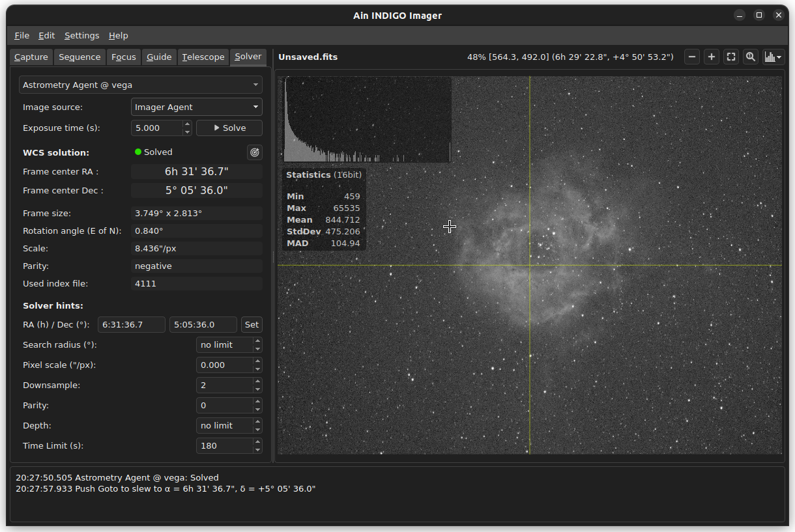

# Ain INDIGO Imager - Users Guide
Revision: 20.01.2023 (early draft)

Author: **Rumen G.Bogdanovski**

e-mail: *rumenastro@gmail.com*

## Introduction
Ain INDIGO Imager is a free and open source astronomical image acquisition software distributed under [INDIGO Astronomy open-source license](https://github.com/indigo-astronomy/indigo_imager/blob/master/LICENSE.md). Ain is designed to be easy to use and lightweight. It requires a running [INDIGO Server](https://github.com/indigo-astronomy/indigo/blob/master/indigo_docs/INDIGO_SERVER_AND_DRIVERS_GUIDE.md).

Ain is supported on Linux and Windows operating systems and is available for download on the [INDIGO Astronomy](https://www.indigo-astronomy.org/downloads.html) website.

Ain is designed to be simple and it has very little busyness logic embedded. It relays on [INDIGO Agents](https://github.com/indigo-astronomy/indigo/blob/master/indigo_docs/INDIGO_AGENTS.md) to operate. It is essentially a user interface for the INDIGO agents and because of that, on connect Ain will automatically load the agents it needs to operate, if they are not loaded.

## Main Window

The main window consists of three main area as seen on the picture below:

### Control area
This the upper left area that consist of several tabs and sub-tabs. This is where all configuration is done and all processes are controlled like guiding, taking exposure etc. It will be described in detail in the following chapters.

### Image area
This is the upper right area of the main image. In this area the recently captured image will be displayed. It is context dependent.

For **Capture**, **Focus** and **Telescope** tabs the last image from the main imaging camera will be displayed. And several overlays can be turned on and off like Histogram and statistics ( controlled by **Settings -> Show image statistics**) and image center mark (**Settings -> Show image center**).  

For **Guider** tab the most recent image from the guiding camera is displayed and it shows overlays for the selected guiding stars and the image reference pint. It is described in detail in a later chapter.

For **Solver** tab it will display the image being solved.

When the Mouse cursor is over the image the current pixel value will be displayed along with the mouse coordinates and the zoom level. Next to them are located several buttons to control the zoom and stretching.

If the current image is solved and the **Solver** or **Telescope** tab is active, the Right ascension and Declination are shown (instead of the pixel coordinates) under the mouse cursor. In this case **Right-Click** on the image will load the coordinates under the mouse in the **Telescope tab** and pressing **Goto** will slew the telescope to center these coordinates (**Control + Right-Click** will slew the telescope directly).

Mouse wheel will zoom in or zoom out the image and **Left-Click + Drag** will pan the image.

### Log area
In this area all messages from the INDIGO framework will be displayed, preceded by a timestamp. There are three types of messages: *Information* - displayed in white, *Error* - displayed in red and *Warning* - displayed in yellow. Ain does not display errors or warnings in dialog boxes, all errors, warnings and messages go to this log. In addition each message can be accompanied by an audible notification. Audible notifications are enabled by **Settings -> Play sound notifications**.

## Connecting to INDIGO services
Ain will automatically discover all INDIGO services available on the network. And depending on **Settings -> Auto connect new services** it will connect or not to the newly discovered services.

Services can be managed from **File -> Available Services** as shown on the screenshot.

All available services will be listed in the above dialog. To connect or disconnect a service the checkbox in front of the item should be checked or unchecked. The connection status of the services will be restored when Ain is restarted, provided that the service is still available. In the example above service "indigosky" is connected and "vega" and "indigo_test" are not.

The auto discovered services will be listed with the "Bonjour" logo in front of their name ("indigosky" and "vega") and can not be removed from the list. They will disappear when the server shuts down and reappear when it is back online.

Services that are not discoverable (not announced on the network or that are on a different network, in a remote observatory for example) can be manually added by the user. The service should be specified in the form **name\@host.domain:port** or **name\@ip_address:port** in the text field below the service list. If **port** is not specified the default INDIGO port (7624) is assumed. Also **name** has only one purpose, to give some meaningful name to the service and has nothing to do with the remote service. It can be any text string. If not specified **host** will be used as a service name. Such services are displayed with a blue planet icon ("indigo_test") and can be removed manually.

## Capture tab
As mentioned above Ain uses agents to operate and the top Combo box is for agent selection. In **Capture** tab all available *Imager Agents* from all connected services will be listed. And depending on **Settings -> Use host suffix** it will show or not the service name as a suffix. Ain can use only one imager agent at a time. Multi agent support will come in the future.

#### Camera
All available cameras to the selected *Imager Agent* Will be listed here. The selected one will be used for image acquisition.

#### Wheel
All available filter wheels to the selected *Imager Agent* Will be listed here. The user should select the one attached to the selected camera.

#### Frame
All frame resolutions and pixel depths supported by the selected camera will be listed here along with the frame types like "Dark", "Light", "Flat" etc.

#### Exposure
This is the exposure time in seconds used used when **Expose** button is pressed to start single or a batch of exposures are captured.

#### Delay
This is the delay in seconds between the exposures taken in a batch.

#### No Frames (Number of Frames)
This is how how many frames should be taken in a batch. Use -1 for infinite number of frames. In this case the batch will finish when **Abort** button is pressed.

#### Filter
All available filters in the selected filter wheel will be listed here. The selected one is the one being used.

#### Object
The name of the object being photographed should be entered here. It is used for the saved file name and for the FITS header. If there is no name specified and **Settings -> Save noname images** is checked, "noname" string will be used as object name.

#### Cooler
If the selected camera can report the sensor temperature the current temperature will be shown here. If the camera supports cooling user can enable and disable cooler and set the target temperature. In this case the cooler power will also be displayed.

### Image tab

#### Preview exposure
This is the time, in seconds, used to get a preview frame with the **Preview** button.

#### Image format
The image file formats supported by the camera driver will be listed here. They can be different for different cameras. The selected format will be used as a storage format for the saved images.

#### Region of interest
The region of interest (ROI) can be configured by specifying **X** and **Y** of the top left corner and **Width** and **Height** of the sub-frame.

### Dithering tab
INDIGO can dither between the frames and it is configured in this tab.

#### Target
All available *Guider agents* will be listed here. The selected one should be the *Guider agent* used for guiding, as this is the agent that will perform the dithering. To disable dithering select "None".

#### Aggressivity
This value, in pixels, specifies at most how many pixels the frame should be shifted during dithering. The actual shift is a random value and this specifies the upper limit.

#### Settle timeout
The settle timeout is in seconds. It specifies how much time to wait for the guiding to settle after dithering. If it is not settled before this timeout is up, a warning will be issued and the imager agent will proceed with the next exposure.

#### Skip Frames
This parameter specifies how many frames to skip after dithering (0 means to dither after each frame).

### Camera tab
In this tab camera specific parameter could be set. Namely gain, offset and binning.

### Remote images tab
INDIGO services can work in the so called "clientless" or "headless" mode. This means that the server can operate autonomously. To achieve that the client must connect, configure the service to perform some specific task, start it and disconnect. The server will store the data locally and when the client connects again it will be able to download the acquired data. This mode is configured in this tab.

 

 To enable the server to store the captured frames on its end, one should check **Save image copies on the server**. If one does not want to have downloaded images deleted from the server one should check **Keep downloaded images on server** otherwise images will be deleted once downloaded.

 If the server is configured to keep the downloaded images they can still be removed when not needed. This is achieved by unchecking **Keep downloaded images on server** and press **Server cleanup**. This will remove all locally downloaded images that are kept on the server and not downloaded will be kept. This is useful when the images should be downloaded to several locations and removed once downloaded everywhere.

## Focus tab
TBD

### Statistics tab
TBD

### Settings tab

Auto focus configuration is described in [INDIGO Imager Agent - Autofocus Tuning Guide](https://github.com/indigo-astronomy/indigo/blob/master/indigo_docs/IMAGING_AF_TUNING.md)

### Misc (Miscellaneous) tab
TBD

## Guide tab
TBD

### Settings tab
TBD

### Advanced tab

*Guder Agent* configuration is described in [INDIGO Guider Agent - PI Controller Tuning](https://github.com/indigo-astronomy/indigo/blob/master/indigo_docs/GUIDING_PI_CONTROLLER_TUNING.md)

### Misc (Miscellaneous) tab
TBD

## Telescope tab
TBD

### Main tab
TBD

### Object tab
Typing in the **Search** field will update the object list as you type with the objects that match the pattern. Once the desired object is selected its coordinates will be loaded in telescope coordinate fields and clicking on **Goto** will point the telescope to the selected object.

#### Manage custom objects
Custom objects can be added by clicking on the **[+]** button in the object tab. The following dialog will appear:

The data fields should be filled and **Add object** button should be pushed.
The telescope coordinates can be loaded in the **Right ascension** and **Declination** fields by pushing the target button.

Pushing the **[-]** button will remove the selected custom object. Please note that standard library objects can not be removed.

### Solver tab
TBD

### Site (geographic location) tab
TBD

### GPS tab
TBD

### Polar align tab

Performing the telescope polar alignment procedure is described in details in [INDIGO Astrometry / ASTAP Agent - Polar Alignment Guide](https://github.com/indigo-astronomy/indigo/blob/master/indigo_docs/POLAR_ALIGNMENT.md)

## Solver tab
Plate solving configuration and usage is described in [INDIGO Astrometry Agent - Plate Solving Guide](https://github.com/indigo-astronomy/indigo/blob/master/indigo_docs/PLATE_SOLVING.md)

If a local file needs to be solved **Image source** should be set to "Upload file" and by pushing the **Solve** button, a file select dialog will popup to choose the file to be solved.
