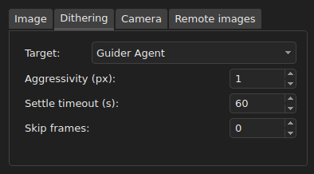
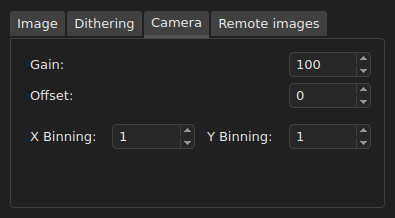

# Ain INDIGO Imager - Users Guide
Revision: 21.01.2023 (early draft)

Author: **Rumen G.Bogdanovski**

e-mail: *rumenastro@gmail.com*

## Table of Contents
1. [Introduction](#introduction)
1. [Main Window](#main-window)
1. [Connecting to INDIGO services](#connecting-to-indigo-services)
1. [Image capture](#image-capture)
1. [Focusing](#focusing)
1. [Guiding](#guiding)
1. [Telescope control](#telescope-control)
1. [Plate solving](#plate-solving)
1. [Accessing advanced device and agent settings](#accessing-advanced-device-and-agent-settings)
1. [Managing service configurations](#managing-service-configurations)

## Introduction
*Ain INDIGO Imager* is a free and open source astronomical image acquisition software distributed under [INDIGO Astronomy open-source license](https://github.com/indigo-astronomy/indigo_imager/blob/master/LICENSE.md). *Ain* is designed to be easy to use and lightweight. It requires a running [INDIGO Server](https://github.com/indigo-astronomy/indigo/blob/master/indigo_docs/INDIGO_SERVER_AND_DRIVERS_GUIDE.md).

*Ain* is supported on Linux and Windows operating systems and is available for download on the [INDIGO Astronomy](https://www.indigo-astronomy.org/downloads.html) website.

*Ain* is designed to be simple and it has very little busyness logic embedded. It relays on [INDIGO Agents](https://github.com/indigo-astronomy/indigo/blob/master/indigo_docs/INDIGO_AGENTS.md) to operate. It is essentially a user interface for the INDIGO agents and because of that, on connect *Ain* will automatically load the agents it needs to operate, if they are not loaded.

## Main Window

The main window is divided in three main areas as seen on the picture below:

Almost all widgets (buttons, combo boxes, spin boxes etc.) have tool-tips that provide information what the widget does. In case of the the numeric values it gives information of the valid range.

### Control area
This is the upper left area that consist of several tabs and sub-tabs. This is where all configuration is done and all processes are controlled like guiding, taking exposure etc. It will be described in detail in the following chapters.

### Image area
This is the upper right area of the main window. In this area the recently captured image will be displayed. It is context dependent.

For **Capture**, **Focus** and **Telescope** tabs the last image from the main imaging camera will be displayed. And several overlays can be turned on and off like Histogram and statistics ( controlled by **Settings -> Show image statistics**) and image center mark (**Settings -> Show image center**).  

For **Guider** tab the most recent image from the guiding camera is displayed and it shows overlays for the selected guiding stars and the image reference pint. It is described in detail in a later chapter.

For **Solver** tab it will display the image being solved.

When the Mouse cursor is over the image the current pixel value will be displayed along with the mouse coordinates and the zoom level. Next to them are located several buttons to control the zoom and stretching.

If the current image is solved and the **Solver** or **Telescope** tab is active, the Right ascension and Declination are shown (instead of the pixel coordinates) under the mouse cursor. In this case **Right-Clicking** on the image will load the coordinates under the mouse in the **Telescope tab** and pushing **Goto** button will slew the telescope to center these coordinates (**Control + Right-Click** will slew the telescope directly).

Mouse wheel will zoom in or zoom out the image and **Left-Click + Drag** will pan the image.

### Log area
Log area is the bottom part of the main window. In this area all messages from the INDIGO framework will be displayed, preceded by a timestamp. There are three types of messages: *Information* - displayed in white, *Error* - displayed in red and *Warning* - displayed in yellow. *Ain* does not display errors or warnings in dialog boxes, all errors, warnings and messages go to this log. In addition each message can be accompanied by an audible notification. Audible notifications are enabled by **Settings -> Play sound notifications**.

## Connecting to INDIGO services
*Ain* will automatically discover all INDIGO services available on the network. And depending on **Settings -> Auto connect new services** it will connect or not to the newly discovered services.

Services can be managed from **File -> Available Services** as shown on the screenshot.

All available services will be listed in the above dialog. To connect or disconnect a service the checkbox in front of the item should be checked or unchecked. The connection status of the services will be restored when *Ain* is restarted, provided that the service is still available. In the example above service "indigosky" is connected and "vega" and "indigo_test" are not.

The auto discovered services will be listed with the "Bonjour" logo in front of their name ("indigosky" and "vega") and can not be removed from the list. They will disappear when the server shuts down and reappear when it is back online.

Services that are not discoverable (not announced on the network or that are on a different network, in a remote observatory for example) can be manually added by the user. The service should be specified in the form **name\@host.domain:port** or **name\@ip_address:port** in the text field below the service list. If **port** is not specified the default INDIGO port (7624) is assumed. Also **name** has only one purpose, to give some meaningful name to the service and has nothing to do with the remote service. It can be any text string. If not specified **host** will be used as a service name. Such services are displayed with a blue planet icon ("indigo_test") and can be removed manually.

## Image capture
As mentioned above *Ain Imager* uses agents to operate and the top Combo box is for agent selection. In **Capture** tab all available *Imager Agents* from all connected services will be listed. And depending on **Settings -> Use host suffix** it will show or not the service name as a suffix. *Ain* can use only one imager agent at a time. Multi agent support will come in the future.

##### Camera
All available cameras to the selected *Imager Agent* Will be listed here. The selected one will be used for image acquisition.

##### Wheel
All available filter wheels to the selected *Imager Agent* Will be listed here. The user should select the one attached to the selected camera.

##### Frame
All frame resolutions and pixel depths supported by the selected camera will be listed here along with the frame types like "Dark", "Light", "Flat" etc.

##### Exposure
This is the exposure time in seconds used used when **Expose** button is pressed to start single or a batch of exposures are captured.

##### Delay
This is the delay in seconds between the exposures taken in a batch.

##### No Frames (Number of Frames)
This is how how many frames should be taken in a batch. Use -1 for infinite number of frames. In this case the batch will finish when **Abort** button is pressed.

##### Filter
All available filters in the selected filter wheel will be listed here. The selected one is the one being used.

##### Object
The name of the object being photographed should be entered here. It is used for the saved file name and for the FITS header. If there is no name specified and **Settings -> Save noname images** is checked, "noname" string will be used as object name.

##### Cooler
If the selected camera can report the sensor temperature the current temperature will be shown here. If the camera supports cooling user can enable and disable cooler and set the target temperature. In this case the cooler power will also be displayed.

### Image tab

##### Preview exposure
This is the time, in seconds, used to get a preview frame with the **Preview** button.

##### Image format
The image file formats supported by the camera driver will be listed here. They can be different for different cameras. The selected format will be used as a storage format for the saved images.

##### Region of interest
The region of interest (ROI) can be configured by specifying **X** and **Y** of the top left corner and **Width** and **Height** of the sub-frame.

### Dithering tab
INDIGO can dither between the frames and it is configured in this tab.

##### Target
All available *Guider agents* will be listed here. The selected one should be the *Guider agent* used for guiding, as this is the agent that will perform the dithering. To disable dithering select "None".

##### Aggressivity
This value, in pixels, specifies at most how many pixels the frame should be shifted during dithering. The actual shift is a random value and this specifies the upper limit.

##### Settle timeout
The settle timeout is in seconds. It specifies how much time to wait for the guiding to settle after dithering. If it is not settled before this timeout is up, a warning will be issued and the imager agent will proceed with the next exposure.

##### Skip Frames
This parameter specifies how many frames to skip after dithering (0 means to dither after each frame).

### Camera tab
In this tab camera specific parameter could be set. Namely gain, offset and binning.

### Remote images tab
INDIGO services can work in the so called "clientless" or "headless" mode. This means that the server can operate autonomously. To achieve that the client must connect, configure the service to perform some specific task, start it and disconnect. The server will store the data locally and when the client connects again it will be able to download the acquired data. This mode is configured in this tab.

 

To enable the server to store the captured frames on its end, one should check **Save image copies on the server**. If one does not want to have downloaded images deleted from the server one should check **Keep downloaded images on server** otherwise images will be deleted once downloaded.

If the server is configured to keep the downloaded images they can still be removed when not needed. This is achieved by unchecking **Keep downloaded images on server** and press **Server cleanup**. This will remove all locally downloaded images that are kept on the server and not downloaded will be kept. This is useful when the images should be downloaded to several locations and removed once downloaded everywhere.

## Focusing
Focusing is a feature of the *Imager Agent* and it works with the selected imager agent.

##### Focuser
All focuser devices available to the selected *Imager Agent* will be listed here. The correct one should be selected.

##### Absolute position
The current focuser position will be displayed here. Entering a new value and pushing the **[>]** button will move the focuser to the new position. It can be used to assist the focusing by going roughly to focus or to retract the focuser at the end of the imaging session.

##### Relative Move
Relative move will help achieve precise focus manually. The value represents how many steeps, relative to the current position, the focuser should move when **[>>]** (focus out) or **[<<]** (focus in) button is pushed.

##### Reference T (Templerature)
There the current temperature will be shown if the focuser has a temperature sensor. if **Auto compensation** is checked the focus will be automatically corrected with the temperature change if the compensation factor is set in the **Misc** tab.This value must be determined by the user as it is setup dependent.

### Statistics tab
Here the essential focusing statistics will be displayed when manual or automatic focusing is started. It is dependent on the focus estimator being used.

### Settings tab

##### Exposure time
Exposure time in seconds used during the focusing process.

##### Focus mode
The focus mode "Manual" or "Auto".

##### Focus estimators
Currently the *Imager Agent* supports two focus estimators "Peak/HFD" and "RMS Contrast".

##### Star selection X/Y
The coordinates of the star that will be used for "Peak/HFD" focusing should be entered here. **Right-Click** on the image will load the coordinates of the cursor  here and will move the selection overlay (a green square).

##### Selection radius
The radius, in pixels, of the aperture used to estimate FWHM and HFD.

##### Autofocus settings
Auto focus configuration is described in [INDIGO Imager Agent - Autofocus Tuning Guide](https://github.com/indigo-astronomy/indigo/blob/master/indigo_docs/IMAGING_AF_TUNING.md)

### Misc (Miscellaneous) tab

##### Save bandwidth
In order to transfer less amount of data through the network sub-frames with size of 10 or 20 radii centered around the selection can be used. This is applicable only for "Peak/HFD" estimator.

##### Focus compensation
This is the temperature compensation factor, in steps per degree celsius. This is how many steps will be applied when **Auto compensation** is ON with each degree change of the ambient temperature.

##### On focus failed (Peak/HFD)
This defines what to do if the auto focus procedure fils. If **Return to the initial position** is checked it will return to the starting position otherwise it will just stop. This applies to "Peak/HFD" estimator only. "RMS Contrast" it will always stop.

##### Invert In and Out motion
If the focuser is inverted and retracts on focus out motion the motion should be inverted. This combo box will be active if the selected focuser supports motion inversion.

## Guiding
*Ain* uses the service *Guider Agent* for guiding. The top combo box has a list of all available guider agents and the correct one should be selected.

##### Camera
All cameras available to the selected *Guider Agent* will be listed here. The correct one should be selected.

##### Guider
All guider devices available to the selected *Guider Agent* will be listed here. The correct one should be selected. They can be part of the mount or the ST4 port oof the guiding camera.

##### Buttons
- **Preview** button will start a loop of exposures with the guider camera.
- **Calibrate** button will start the calibration process during which the guiding parameters will be determined automatically.
- **Guide** button starts the Guiding
- **Stop** button will stop each of the above processes.

### Settings tab

##### Exposure
Exposure time and delay between exposures can be specified in this section. Both are in seconds.

##### Guiding
*Guider Agent* provides several algorithms for drift detection and several options for Guiding in declination. Both can be selected here.

In "Selection" guiding the primary star can be selected by **Right-Clicking** on the star or by entering the coordinates in **Star Selection X/Y** fields. The radius of the circle where the star can drift between two consecutive frames is specified in **Selection radius** field. And for multi-star "Selection" guiding the number of stars to be used can be specified in the **Star count** field.

Only the first star can be selected manually or automatically. All other stars can only be auto selected. The list of the selected star can be cleared by pushing **Clear star selection** button. This will force the *Guider Agent* to make a new selection when any process is started.

In "Donuts" guiding the whole frame is used to detect drift but some cameras have unusable border around the frame. This can interfere with the guiding and this area can be excluded by specifying **Edge Clipping**

### Advanced tab

*Guder Agent* configuration is described in [INDIGO Guider Agent - PI Controller Tuning](https://github.com/indigo-astronomy/indigo/blob/master/indigo_docs/GUIDING_PI_CONTROLLER_TUNING.md) and in [Guider Agent README](https://github.com/indigo-astronomy/indigo/blob/master/indigo_drivers/agent_guider/README.md)

Calibration parameters will be automatically computed during the "calibration" process but they can be fine-tuned manually.

### Misc (Miscellaneous) tab

##### Save bandwidth
There are two options to reduce network traffic. As the guiding is done on the server
*Ain Imager* does not need a full resolution raw frames. It need basic images for visualization. This is why the user can choose to download JPEG images which can be more than 10x smaller and image sub-frames.

##### Camera Settings
Frame format, gain and offset of the guiding camera can be specified in this section.

##### Guider Scope Profile
The focal length of the guider scope should be entered in order to enable the drift to be displayed in arc seconds. Otherwise **Settings -> Guider Graph -> RA / Dec Drift (arcsec)** will have no effect and statistics and graph will be in pixels.

## Telescope control
*Ain* uses the service *Mount Agent* to control mounts. The top combo box has a list of all available mount agents and the correct one should be selected.

If the displayed image is solved a **Right-Click** on it will load the coordinates under the mouse cursor in the **RA / Dec input** boxes and pushing **Goto** button will slew the telescope to these coordinates. **Control + Right-Click** will slew the telescope directly.

##### Mount
All mounts available to the selected *Guider Agent* will be listed here. The correct one should be selected.

##### RA / Dec input
In these fields the target Right ascension and Declination should be entered. They will be used for goto if **Goto** is button is pushed or to synchronize the mount to these coordinates if **Sync** is button is pushed.

### Main tab

##### N S W E buttons and slew rates
The mount can be moved by pushing **N S W E** buttons. The speed is selected from four available presets. The slowest is **Guide rate** and the fastest is **Max rate**.

##### Tracking / Not Tracking
This check box controls the mount tracking. The mount tracking is enabled if it is checked.

##### Go home
Checking this check box will slew the mount to its home position.

##### Parked / Unparked
Checking this checkbox will slew the mount to its park position.

### Object tab
Typing in the **Search** field will update the object list as you type with the objects that match the pattern. Once the desired object is selected its coordinates will be loaded in telescope coordinate fields and clicking on **Goto** will point the telescope to the selected object.

#### Manage custom objects
Custom objects can be added by clicking on the **[+]** button in the object tab. The following dialog will appear:

The data fields should be filled and **Add object** button should be pushed.
The telescope coordinates can be loaded in the **Right ascension** and **Declination** fields by pushing the target button.

Pushing the **[-]** button will remove the selected custom object. Please note that standard library objects can not be removed.

### Solver tab

In the solver tab the user should select the image source and exposure time to be used and can perform two operations:
- **Solve & Center** - the selected agent will take exposure solve it and using the solution as a reference will perform precise goto to the desired coordinates.
- **Solve & Sync** - the selected agent will take exposure solve it and the solution will be set to the telescope as a reference (sync the telescope with the solution). This will allow precise goto in the vicinity.

### Site (geographic location) tab

In the **Source** combo box all available geo location sources will be listed. Such as the GPS device selected in the **GPS** tab or the selected **Mount Agent** coordinates, which are set in the **Set Location / Time** section.

If **Keep the mount time synchronized** is checked each time the time or geo coordinates of the source are changed the mount will be updated. This is somewhat dangerous as the GPS may loose signal and the mount will loose alignment.

### GPS tab

In the **GPS** combo box all available GPS devices will be listed. The selected GPS can be used as a time and geographic coordinates source in the **Site** tab. It also shows the position data from the selected device.

### Polar align tab

Performing the telescope polar alignment procedure is described in details in [INDIGO Astrometry / ASTAP Agent - Polar Alignment Guide](https://github.com/indigo-astronomy/indigo/blob/master/indigo_docs/POLAR_ALIGNMENT.md).

## Plate solving
Plate solving configuration and usage is described in [INDIGO Astrometry Agent - Plate Solving Guide](https://github.com/indigo-astronomy/indigo/blob/master/indigo_docs/PLATE_SOLVING.md) and in [Astrometry Agent README](https://github.com/indigo-astronomy/indigo/blob/master/indigo_drivers/agent_astrometry/README.md)

If a local file needs to be solved **Image source** should be set to "Upload file" and by pushing the **Solve** button, a file select dialog will popup to choose the file to be solved.

## Accessing advanced device and agent settings

*Ain Imager* provides access to a subset of the standard properties of the devices and agents. The whole set of properties can be monitored and modified with the *INDIGO Control Panel*, free and open source application available for Linux and Windows.

 

 *Ain* provides a shortcut to it from **File -> INDIGO Control Panel**.

*INDIGO Control Panel* is essential for the initial service configuration like loading the necessary drivers and initial device configuration.

## Managing service configurations

Note: This feature is experimental!

*Ain Imager* can use *Configuration Agents* running on INDIGO services to manage the configuration of each service. It can save, load, delete and create new configurations for each INDIGO service. Configuration manager dialog can be accessed from **File -> Manage service configurations**.

Available configuration agents will be listed in the top combo box and available configurations will be listed in the **Configuration** combo box.

More information about configuration management can be found in [INDIGO Configuration Agent README](https://github.com/indigo-astronomy/indigo/blob/master/indigo_drivers/agent_config/README.md).
